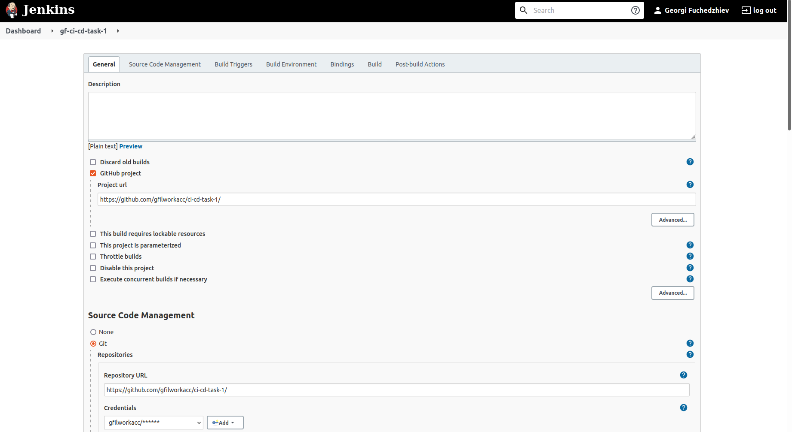
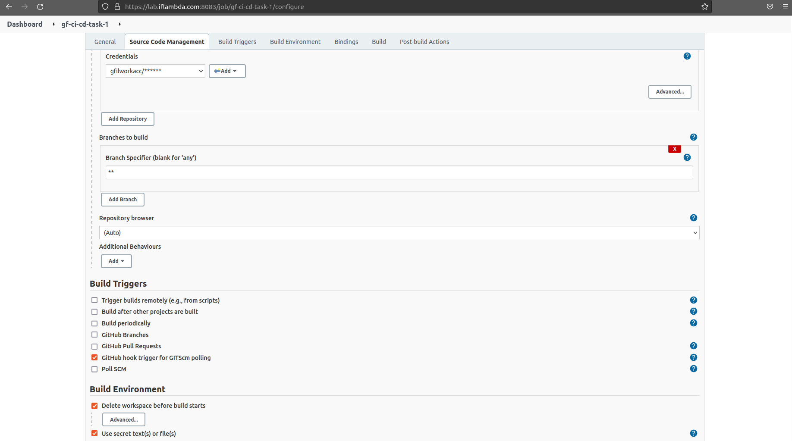
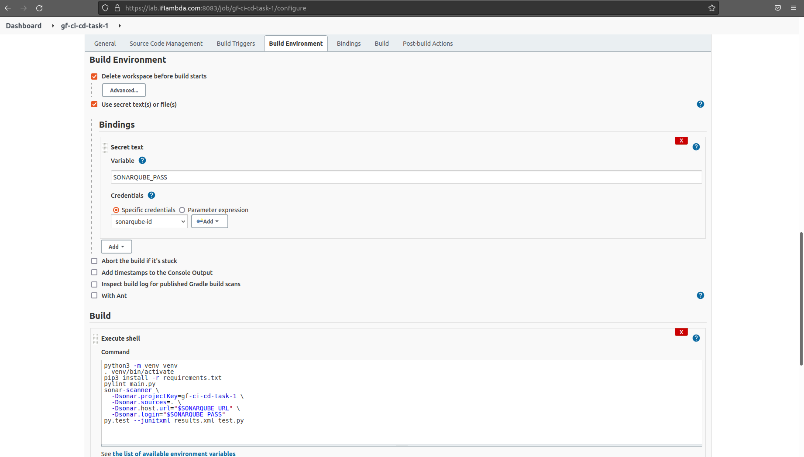
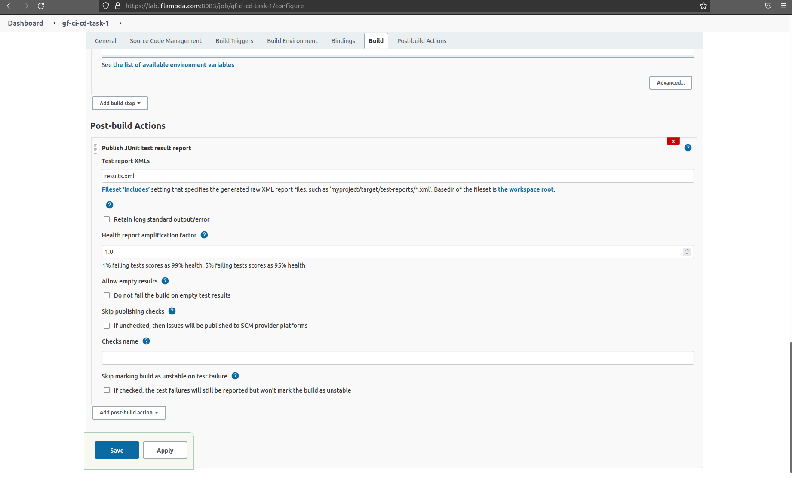
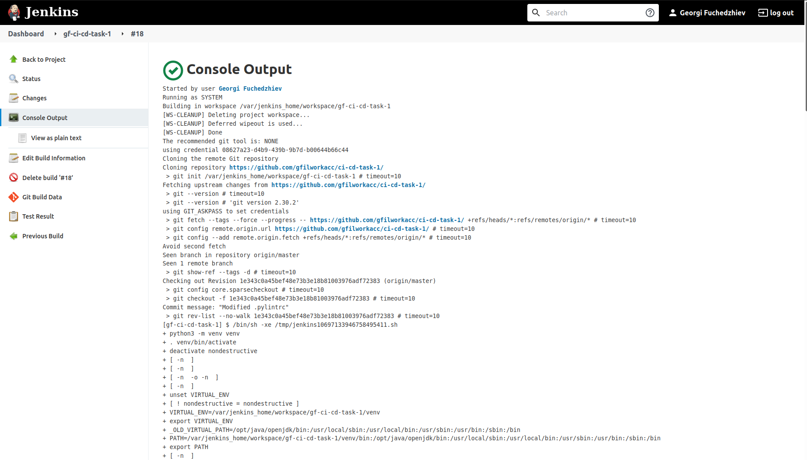
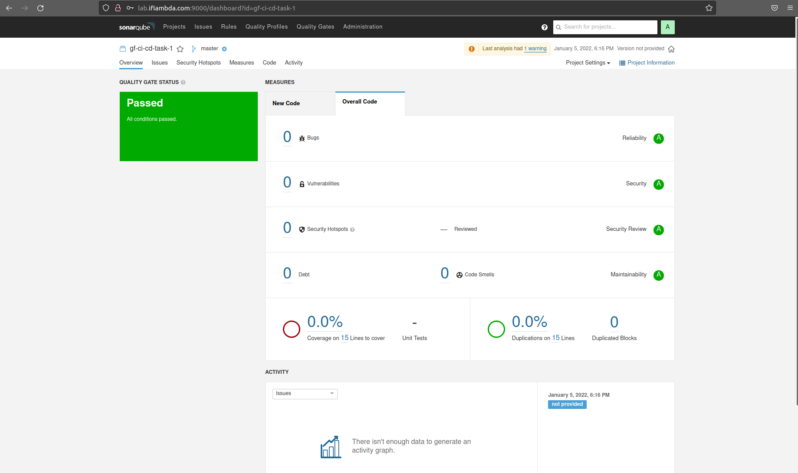

# CI/CD Labs task 1:
## Clone https://github.com/csuvikg/tap-ci
## Build a CI pipeline that builds the project, runs linting and tests
## Trigger build by pushing to the main
## (Optional) add SonarQube check to the build

### Building and execution of the pipeline done on https://lab.iflambda.com:8083

### Pipeline's configuration:









### Results :
```bash
Started by user Georgi Fuchedzhiev
Running as SYSTEM
Building in workspace /var/jenkins_home/workspace/gf-ci-cd-task-1
[WS-CLEANUP] Deleting project workspace...
[WS-CLEANUP] Deferred wipeout is used...
[WS-CLEANUP] Done
The recommended git tool is: NONE
using credential 08627a23-d4b9-439b-9b7d-b00644b66c44
Cloning the remote Git repository
Cloning repository https://github.com/gfilworkacc/ci-cd-task-1/
 > git init /var/jenkins_home/workspace/gf-ci-cd-task-1 # timeout=10
Fetching upstream changes from https://github.com/gfilworkacc/ci-cd-task-1/
 > git --version # timeout=10
 > git --version # 'git version 2.30.2'
using GIT_ASKPASS to set credentials 
 > git fetch --tags --force --progress -- https://github.com/gfilworkacc/ci-cd-task-1/ +refs/heads/*:refs/remotes/origin/* # timeout=10
 > git config remote.origin.url https://github.com/gfilworkacc/ci-cd-task-1/ # timeout=10
 > git config --add remote.origin.fetch +refs/heads/*:refs/remotes/origin/* # timeout=10
Avoid second fetch
Seen branch in repository origin/master
Seen 1 remote branch
 > git show-ref --tags -d # timeout=10
Checking out Revision 1e343c0a45bef48e73b3e18b81003976adf72383 (origin/master)
 > git config core.sparsecheckout # timeout=10
 > git checkout -f 1e343c0a45bef48e73b3e18b81003976adf72383 # timeout=10
Commit message: "Modified .pylintrc"
 > git rev-list --no-walk 1e343c0a45bef48e73b3e18b81003976adf72383 # timeout=10
[gf-ci-cd-task-1] $ /bin/sh -xe /tmp/jenkins10697133946758495411.sh
+ python3 -m venv venv
+ . venv/bin/activate
+ deactivate nondestructive
+ [ -n  ]
+ [ -n  ]
+ [ -n  -o -n  ]
+ [ -n  ]
+ unset VIRTUAL_ENV
+ [ ! nondestructive = nondestructive ]
+ VIRTUAL_ENV=/var/jenkins_home/workspace/gf-ci-cd-task-1/venv
+ export VIRTUAL_ENV
+ _OLD_VIRTUAL_PATH=/opt/java/openjdk/bin:/usr/local/sbin:/usr/local/bin:/usr/sbin:/usr/bin:/sbin:/bin
+ PATH=/var/jenkins_home/workspace/gf-ci-cd-task-1/venv/bin:/opt/java/openjdk/bin:/usr/local/sbin:/usr/local/bin:/usr/sbin:/usr/bin:/sbin:/bin
+ export PATH
+ [ -n  ]
+ [ -z  ]
+ _OLD_VIRTUAL_PS1=$ 
+ PS1=(venv) $ 
+ export PS1
+ [ -n  -o -n  ]
+ pip3 install -r requirements.txt
Collecting pytest~=6.2.5
  Using cached pytest-6.2.5-py3-none-any.whl (280 kB)
Collecting pylint
  Using cached pylint-2.12.2-py3-none-any.whl (414 kB)
Collecting iniconfig
  Using cached iniconfig-1.1.1-py2.py3-none-any.whl (5.0 kB)
Collecting packaging
  Using cached packaging-21.3-py3-none-any.whl (40 kB)
Collecting toml
  Using cached toml-0.10.2-py2.py3-none-any.whl (16 kB)
Collecting attrs>=19.2.0
  Using cached attrs-21.4.0-py2.py3-none-any.whl (60 kB)
Collecting pluggy<2.0,>=0.12
  Using cached pluggy-1.0.0-py2.py3-none-any.whl (13 kB)
Collecting py>=1.8.2
  Using cached py-1.11.0-py2.py3-none-any.whl (98 kB)
Collecting astroid<2.10,>=2.9.0
  Using cached astroid-2.9.2-py3-none-any.whl (254 kB)
Collecting isort<6,>=4.2.5
  Using cached isort-5.10.1-py3-none-any.whl (103 kB)
Collecting platformdirs>=2.2.0
  Using cached platformdirs-2.4.1-py3-none-any.whl (14 kB)
Collecting typing-extensions>=3.10.0
  Using cached typing_extensions-4.0.1-py3-none-any.whl (22 kB)
Collecting mccabe<0.7,>=0.6
  Using cached mccabe-0.6.1-py2.py3-none-any.whl (8.6 kB)
Collecting wrapt<1.14,>=1.11
  Using cached wrapt-1.13.3-cp39-cp39-manylinux_2_5_x86_64.manylinux1_x86_64.manylinux_2_12_x86_64.manylinux2010_x86_64.whl (81 kB)
Requirement already satisfied: setuptools>=20.0 in ./venv/lib/python3.9/site-packages (from astroid<2.10,>=2.9.0->pylint->-r requirements.txt (line 2)) (44.1.1)
Collecting lazy-object-proxy>=1.4.0
  Using cached lazy_object_proxy-1.7.1-cp39-cp39-manylinux_2_5_x86_64.manylinux1_x86_64.manylinux_2_17_x86_64.manylinux2014_x86_64.whl (61 kB)
Collecting pyparsing!=3.0.5,>=2.0.2
  Using cached pyparsing-3.0.6-py3-none-any.whl (97 kB)
Installing collected packages: wrapt, typing-extensions, pyparsing, lazy-object-proxy, toml, py, pluggy, platformdirs, packaging, mccabe, isort, iniconfig, attrs, astroid, pytest, pylint
Successfully installed astroid-2.9.2 attrs-21.4.0 iniconfig-1.1.1 isort-5.10.1 lazy-object-proxy-1.7.1 mccabe-0.6.1 packaging-21.3 platformdirs-2.4.1 pluggy-1.0.0 py-1.11.0 pylint-2.12.2 pyparsing-3.0.6 pytest-6.2.5 toml-0.10.2 typing-extensions-4.0.1 wrapt-1.13.3
+ pylint main.py

--------------------------------------------------------------------
Your code has been rated at 10.00/10 (previous run: 10.00/10, +0.00)

+ sonar-scanner -Dsonar.projectKey=gf-ci-cd-task-1 -Dsonar.sources=. -Dsonar.host.url=http://lab.iflambda.com:9000 -Dsonar.login=\*\*\*\*
INFO: Scanner configuration file: /opt/sonar-scanner/conf/sonar-scanner.properties
INFO: Project root configuration file: NONE
INFO: SonarScanner 4.6.2.2472
INFO: Java 11.0.11 AdoptOpenJDK (64-bit)
INFO: Linux 5.13.0-22-generic amd64
INFO: User cache: /var/jenkins_home/.sonar/cache
INFO: Scanner configuration file: /opt/sonar-scanner/conf/sonar-scanner.properties
INFO: Project root configuration file: NONE
INFO: Analyzing on SonarQube server 9.2.4
INFO: Default locale: "en", source code encoding: "UTF-8" (analysis is platform dependent)
INFO: Load global settings
INFO: Load global settings (done) | time=83ms
INFO: Server id: BF41A1F2-AX4l6nNQQJe4dLlvEkuR
INFO: User cache: /var/jenkins_home/.sonar/cache
INFO: Load/download plugins
INFO: Load plugins index
INFO: Load plugins index (done) | time=45ms
INFO: Load/download plugins (done) | time=119ms
INFO: Process project properties
INFO: Process project properties (done) | time=7ms
INFO: Execute project builders
INFO: Execute project builders (done) | time=1ms
INFO: Project key: gf-ci-cd-task-1
INFO: Base dir: /var/jenkins_home/workspace/gf-ci-cd-task-1
INFO: Working dir: /var/jenkins_home/workspace/gf-ci-cd-task-1/.scannerwork
INFO: Load project settings for component key: 'gf-ci-cd-task-1'
INFO: Load project settings for component key: 'gf-ci-cd-task-1' (done) | time=22ms
INFO: Auto-configuring with CI 'Jenkins'
INFO: Load quality profiles
INFO: Load quality profiles (done) | time=51ms
INFO: Auto-configuring with CI 'Jenkins'
INFO: Load active rules
INFO: Load active rules (done) | time=1474ms
INFO: Indexing files...
INFO: Project configuration:
INFO: 4 files indexed
INFO: 3058 files ignored because of scm ignore settings
INFO: Quality profile for py: Sonar way
INFO: ------------- Run sensors on module gf-ci-cd-task-1
INFO: Load metrics repository
INFO: Load metrics repository (done) | time=28ms
INFO: Sensor Python Sensor [python]
WARN: Your code is analyzed as compatible with python 2 and 3 by default. This will prevent the detection of issues specific to python 2 or python 3. You can get a more precise analysis by setting a python version in your configuration via the parameter "sonar.python.version"
INFO: Starting global symbols computation
INFO: 2 source files to be analyzed
INFO: Load project repositories
INFO: Load project repositories (done) | time=16ms
INFO: 2/2 source files have been analyzed
INFO: Starting rules execution
INFO: 2 source files to be analyzed
INFO: 2/2 source files have been analyzed
INFO: Sensor Python Sensor [python] (done) | time=483ms
INFO: Sensor Cobertura Sensor for Python coverage [python]
INFO: Sensor Cobertura Sensor for Python coverage [python] (done) | time=32ms
INFO: Sensor PythonXUnitSensor [python]
INFO: Sensor PythonXUnitSensor [python] (done) | time=16ms
INFO: Sensor JaCoCo XML Report Importer [jacoco]
INFO: 'sonar.coverage.jacoco.xmlReportPaths' is not defined. Using default locations: target/site/jacoco/jacoco.xml,target/site/jacoco-it/jacoco.xml,build/reports/jacoco/test/jacocoTestReport.xml
INFO: No report imported, no coverage information will be imported by JaCoCo XML Report Importer
INFO: Sensor JaCoCo XML Report Importer [jacoco] (done) | time=3ms
INFO: Sensor CSS Rules [javascript]
INFO: No CSS, PHP, HTML or VueJS files are found in the project. CSS analysis is skipped.
INFO: Sensor CSS Rules [javascript] (done) | time=1ms
INFO: Sensor C# Project Type Information [csharp]
INFO: Sensor C# Project Type Information [csharp] (done) | time=1ms
INFO: Sensor C# Analysis Log [csharp]
INFO: Sensor C# Analysis Log [csharp] (done) | time=9ms
INFO: Sensor C# Properties [csharp]
INFO: Sensor C# Properties [csharp] (done) | time=0ms
INFO: Sensor JavaXmlSensor [java]
INFO: Sensor JavaXmlSensor [java] (done) | time=1ms
INFO: Sensor HTML [web]
INFO: Sensor HTML [web] (done) | time=2ms
INFO: Sensor VB.NET Project Type Information [vbnet]
INFO: Sensor VB.NET Project Type Information [vbnet] (done) | time=1ms
INFO: Sensor VB.NET Analysis Log [vbnet]
INFO: Sensor VB.NET Analysis Log [vbnet] (done) | time=10ms
INFO: Sensor VB.NET Properties [vbnet]
INFO: Sensor VB.NET Properties [vbnet] (done) | time=0ms
INFO: ------------- Run sensors on project
INFO: Sensor Zero Coverage Sensor
INFO: Sensor Zero Coverage Sensor (done) | time=8ms
INFO: SCM Publisher SCM provider for this project is: git
INFO: SCM Publisher 2 source files to be analyzed
INFO: SCM Publisher 2/2 source files have been analyzed (done) | time=75ms
INFO: CPD Executor 2 files had no CPD blocks
INFO: CPD Executor Calculating CPD for 0 files
INFO: CPD Executor CPD calculation finished (done) | time=0ms
INFO: Analysis report generated in 56ms, dir size=111.4 kB
INFO: Analysis report compressed in 14ms, zip size=16.2 kB
INFO: Analysis report uploaded in 29ms
INFO: ANALYSIS SUCCESSFUL, you can browse http://lab.iflambda.com:9000/dashboard?id=gf-ci-cd-task-1
INFO: Note that you will be able to access the updated dashboard once the server has processed the submitted analysis report
INFO: More about the report processing at http://lab.iflambda.com:9000/api/ce/task?id=AX4rBrTeXRokdZ_GqEiU
INFO: Analysis total time: 4.563 s
INFO: ------------------------------------------------------------------------
INFO: EXECUTION SUCCESS
INFO: ------------------------------------------------------------------------
INFO: Total time: 5.583s
INFO: Final Memory: 16M/57M
INFO: ------------------------------------------------------------------------
+ py.test --junitxml results.xml test.py
============================= test session starts ==============================
platform linux -- Python 3.9.2, pytest-6.2.5, py-1.11.0, pluggy-1.0.0
rootdir: /var/jenkins_home/workspace/gf-ci-cd-task-1
collected 4 items

test.py ....                                                             [100%]

- generated xml file: /var/jenkins_home/workspace/gf-ci-cd-task-1/results.xml --
============================== 4 passed in 0.01s ===============================
Recording test results
[Checks API] No suitable checks publisher found.
Finished: SUCCESS
```




